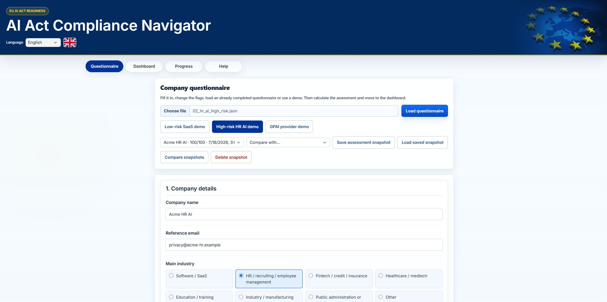
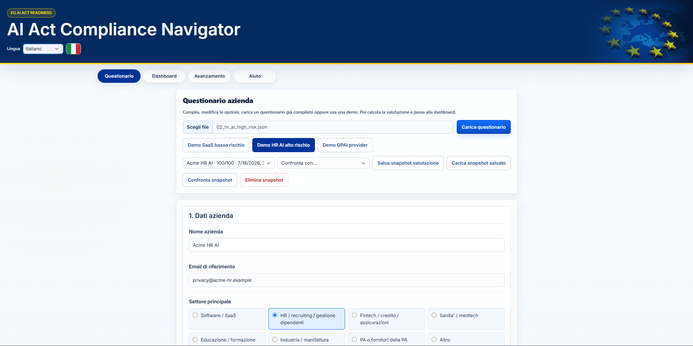
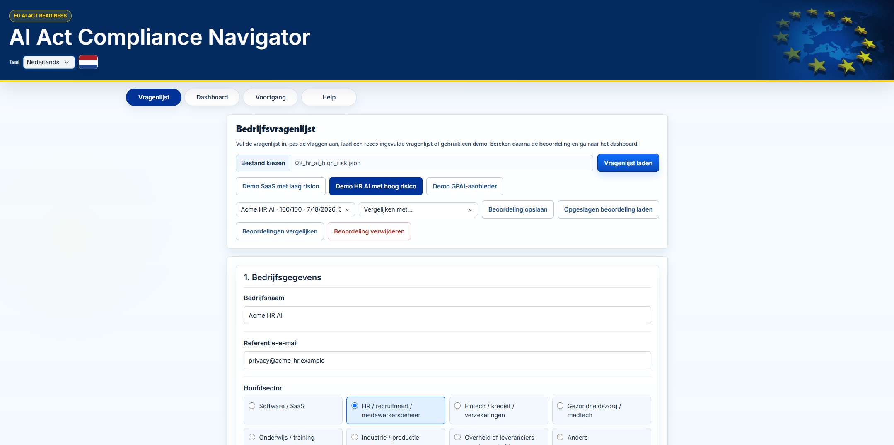
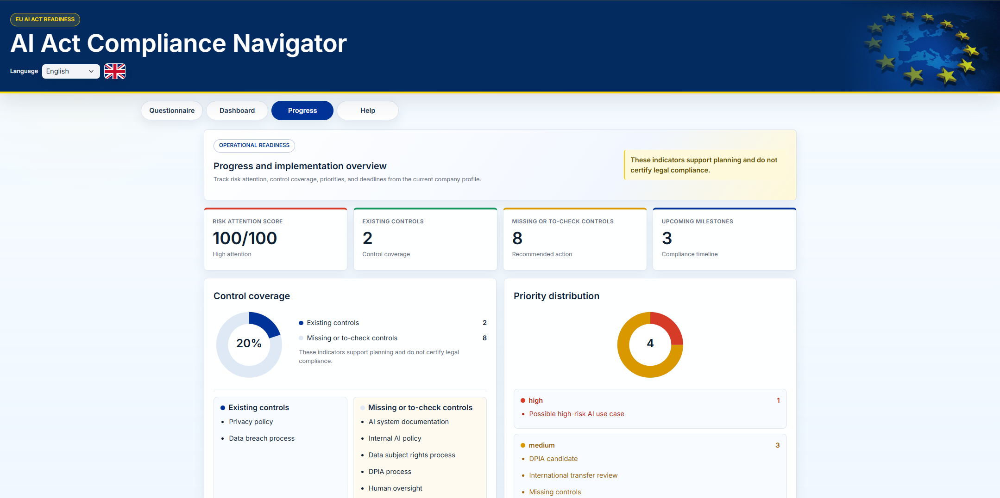
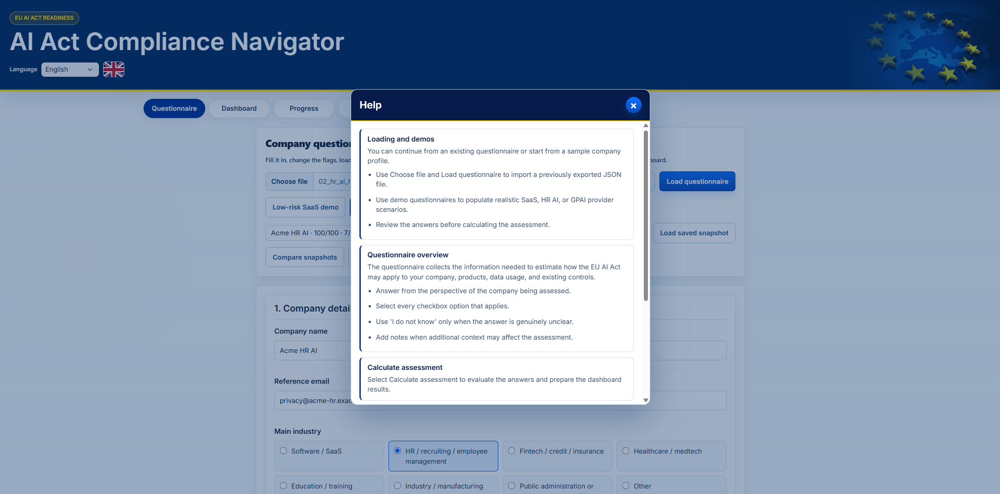
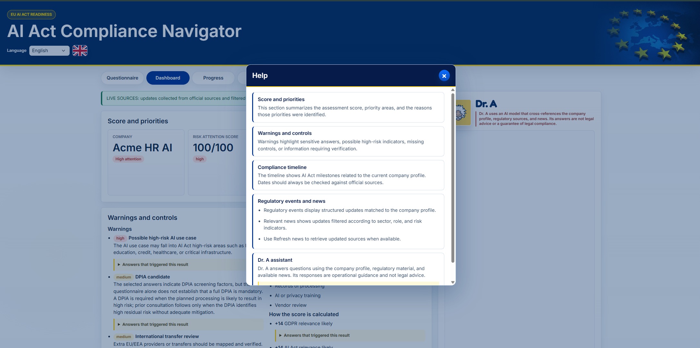
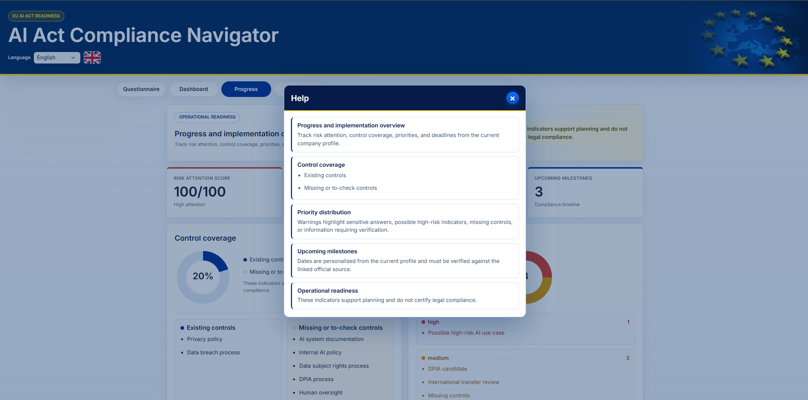
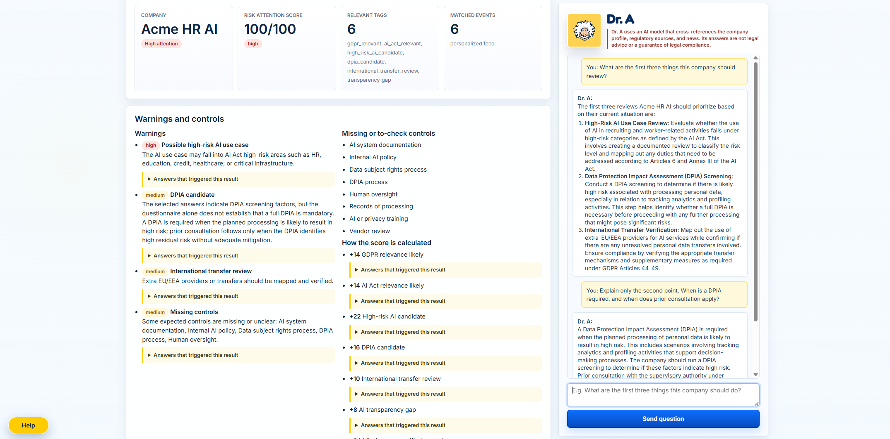
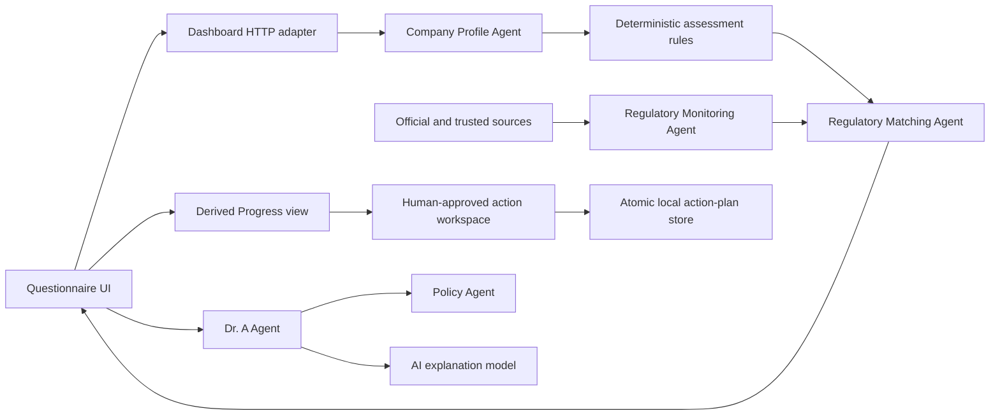

# Dr. A - G.D.P.R. & AI Act Navigator

An explainable regulatory-intelligence prototype for European SMEs. It turns a
guided company questionnaire into a company-specific GDPR and EU AI Act risk
profile, filters official regulatory updates, and provides an AI assistant
that answers with the active company context.

The **Compliance Action Workspace** converts
validated missing controls into prioritized work with an owner, due date,
human approval, evidence, and an auditable revision history.

> This project supports regulatory triage and prioritization. It does not
> provide legal advice or replace professional legal review.

## Why This Matters

The EU AI Act is now in force and phasing in on a hard timeline: prohibited
practices and AI-literacy duties applied from February 2025, general-purpose AI
obligations from August 2025, and the bulk of high-risk obligations from August
2026. Non-compliance is expensive — up to **€35M or 7% of global annual
turnover** for prohibited-practice breaches, layered on top of GDPR's €20M / 4%.
Large enterprises have legal teams for this; **SMEs are the least equipped and
most exposed**. This tool gives an SME a fast, explainable, source-linked read on
which obligations actually apply to *them* and what to prioritize first.

## Responsible AI, Measured

Because this is itself an AI system, we hold it to the standard it helps others
meet:

- **We apply the AI Act to ourselves.** See the
  [AI Act self-assessment](docs/ai-act-self-assessment.md), which classifies the
  Dr. A assistant by risk tier and maps each obligation to how we meet it.
- **The guardrails are measured, not just claimed.** A deterministic,
  CI-enforced golden set blocks **100% of 32 adversarial cases** (evasion, fraud,
  prompt injection, legal-guarantee requests, unsafe output) across **English and
  Italian**, with **zero false blocks** on 20 benign compliance questions.
  Reproduce with `python -m policy_agent.eval`.
- **Every scored risk line is citation-grade.** Events carry structured
  `legal_citations` pointing to the specific AI Act / GDPR articles they derive
  from, with stable EUR-Lex links and a last-verified date.

## Interface Screenshots

### Web Page

The browser interface is shown first, from the localized questionnaire through
the assessment, Progress, Help, and grounded Dr. A views. This is also the first
interface used during company presentations.

#### Localized questionnaire experience

The questionnaire and dashboard use separate local dictionaries for all 25
supported languages. The same Acme HR AI profile is shown below in English,
Italian, and Dutch without an external translation API.







#### Progress and implementation overview

The derived Progress view presents the active assessment as control coverage,
warning-priority distribution, and upcoming milestones without introducing a
second score or hidden state.



#### Contextual Help in the questionnaire

The Help panel explains loading, demo profiles, questionnaire choices,
assessment calculation, snapshots, and navigation while preserving the active
page in the background.



The Dashboard and Progress pages provide their own contextual explanations.





#### Personalized dashboard and grounded Dr. A conversation

Dr. A combines the current company profile with the available regulatory
evidence, while deterministic policy and grounding checks remain independent
from the model explanation layer.



## What It Demonstrates

- A mouse-friendly company onboarding questionnaire localized in all 25 supported languages.
- Deterministic GDPR and AI Act applicability rules with explainable scoring.
- Different scores, warnings, and priorities for different company profiles.
- Direct links to specific European Commission, EUR-Lex, and EDPB sources.
- Manual live collection for the updates and early-warning panels, clearly separated from bundled regulatory-event examples.
- A `gpt-5.6-sol` assistant, Dr. A, with short conversation memory, evidence filtering, and progressively validated streaming responses through the official OpenAI API.
- English and Italian Policy Agent safeguards for evasion, fraud, prompt injection, and requests for guaranteed legal conclusions.
- Persistent local assessment snapshots, a personalised AI Act timeline, and PDF/DOCX reports localized from the selected dashboard language.
- A derived Progress view for control coverage, warning-priority distribution, and upcoming milestones without introducing a second scoring system.
- A persistent Compliance Action Workspace that turns missing controls into prioritized, owned tasks with human approval and evidence gates.
- Contextual, keyboard-accessible Help for the questionnaire, dashboard, and Progress view, translated locally in all 25 supported languages.
- A reproducible Docker setup and one-click Windows launcher.
- A modular monitoring pipeline with automated tests and CI smoke checks.

## Product Flow



The deterministic layer remains the source of truth for applicability and
scoring. The language model explains the resulting context; it does not invent
the compliance classification.

## Quick Start

Clone or download the repository:

```bash
git clone https://github.com/alessandrob1-star/dr-gdpr-ai-act-navigator.git
cd dr-gdpr-ai-act-navigator
```

For detailed platform-specific setup and troubleshooting, see the
**[Installation and Evaluation Guide](docs/INSTALLATION.md)**.

### Recommended Company Presentation

The presentation runs entirely in the browser with the local Ollama/Qwen model.

#### 1. Start Ollama/Qwen and show the web page

Open Ollama, make sure the local model is available, and launch the browser UI:

```powershell
ollama pull qwen2.5:14b-instruct
.\Start web page with Qwen.bat
```

The launcher opens `http://localhost:8771`. Present the questionnaire,
assessment results, regulatory evidence, Progress view, and Dr. A conversation.

#### Local model configuration

Equivalent environment variables:

```powershell
$env:MODEL_PROVIDER = "local"
$env:LOCAL_MODEL_ENDPOINT = "http://localhost:11434/v1/chat/completions"
$env:LOCAL_MODEL_NAME = "qwen2.5:14b-instruct"
& ".\Start dashboard.bat"
```

### Web Page With OpenAI (Alternative)

Requirements: Windows 10/11, Python 3.11 or later, and an OpenAI Platform API
key with API billing or credits enabled.

1. Clone or download the repository.
2. Double-click `Start with OpenAI.bat`.
3. Enter the API key in the private prompt.
4. Open `http://localhost:8771` if the browser does not open automatically.

Close the launcher window or press `Ctrl+C` to stop the web server.

### Docker

```bash
export OPENAI_API_KEY="your-project-key"
chmod +x start-demo.sh stop-demo.sh
./start-demo.sh
```

The script runs the same OpenAI configuration in Docker and opens
`http://localhost:8771` when ready. Stop with:

```bash
./stop-demo.sh
```

### AI assistant runtime

Dr. A supports two model providers without changing the assessment logic:

- **Local presentation mode:** Ollama with `qwen2.5:14b-instruct` through the
  local OpenAI-compatible endpoint at `http://localhost:11434/v1/chat/completions`.
- **OpenAI mode:** the configured OpenAI model through the official API.

The recommended company presentation uses local mode and does not require an
OpenAI API key. Set `MODEL_PROVIDER=local`, or use one of the Qwen launchers.
For OpenAI mode, `Start with OpenAI.bat` stores the API key outside the
repository using Windows DPAPI, encrypted for the current Windows account.

```powershell
$env:OPENAI_API_KEY = "your-project-key"
& ".\Start dashboard.bat"
```

On macOS and Linux:

```bash
OPENAI_API_KEY="your-project-key" ./Start-Dashboard.sh
```

## Five-Minute Demo

For the fastest possible start (no empty dashboard), seed a sample assessment and
launch the server in one command:

```bash
python scripts/golden_path_demo.py
```

This evaluates a bundled HR-screening SME profile deterministically (no model
required), saves it as a snapshot, and opens a populated web page on
`http://localhost:8771`. The Dr. A chat additionally needs either the local
Ollama/Qwen configuration or an OpenAI API key, but scores, warnings, and
matched events render immediately.

Then, to walk the full flow:

1. Select one of the three included company profiles:
   - low-risk SaaS using AI internally;
   - HR screening AI using candidate data, profiling, and decision support with human review;
   - general-purpose AI model provider.
2. Calculate the assessment and compare the score and warnings.
3. Open the dashboard and inspect matched regulatory events.
4. Follow a direct link to its supporting official source.
5. Select **Refresh news** to query the configured official pages.
6. Ask Dr. A which controls the selected company should prioritize.
7. Ask a follow-up question and test a Policy Agent boundary.
8. Save and compare two assessment snapshots.
9. Open **Progress**, approve an action, assign its owner and due date, then
   complete it with an evidence note.
10. Export the active assessment as PDF or DOCX.

## Architecture

| Component | Responsibility |
|---|---|
| Questionnaire UI | Captures normalized company, AI-use, privacy, transfer, and governance signals |
| Company Profile Agent | Validates questionnaire answers and builds deterministic company memory |
| Regulatory Monitoring Agent | Refreshes curated sources and selects live, cached, or disclosed demo feed data |
| Regulatory Matching Agent | Matches company memory to warnings, controls, events, timelines, and evidence |
| Dashboard | Displays company-specific scores, warnings, controls, events, and updates |
| Progress view | Visualizes existing and missing controls, warning priorities, and upcoming milestones from the active assessment |
| Compliance Action Workspace | Persists prioritized tasks derived from missing controls and enforces owner, human-approval, and evidence gates |
| Dr. A Agent | Builds question-specific evidence, calls OpenAI GPT-5.6 Sol, validates output, and streams the answer |
| Policy Agent | Applies deterministic input and output boundaries independently from the language model |

The deterministic assessment and web server use the Python standard library;
PDF and DOCX exports add ReportLab and python-docx. Dr. A uses the official
OpenAI Chat Completions endpoint with `gpt-5.6-sol`. This keeps the core rules
auditable while the explanation layer remains model-driven.

## Current Implementation Status

| Capability | Status |
|---|---|
| Integrated questionnaire and dashboard | Implemented |
| All 25 supported language dictionaries | Implemented |
| Three differentiated demo profiles | Implemented |
| Deterministic relevance tags and risk score | Implemented |
| Direct official-source links | Implemented |
| Manual live refresh from curated official sources | Implemented |
| GPT-5.6 Sol assistant with short conversation memory | Implemented |
| English and Italian Policy Agent safeguards | Implemented |
| Dockerized cross-platform demo | Implemented |
| Persistent local assessment history and snapshot comparison | Implemented |
| Personalized AI Act timeline | Implemented |
| PDF and DOCX report export in all 25 local languages | Implemented |
| Derived Progress view with contextual Help | Implemented |
| Human-approved Compliance Action Workspace | Implemented (English workflow) |
| Evidence-filtered citations for supported regulatory claims | Implemented |
| Contextual and floating Help in all 25 supported languages | Implemented |
| Production scheduling and complete EU source coverage | Out of MVP scope |

## Repository Structure

```text
module_company_profile/
  dashboard/          Integrated questionnaire, dashboard, and Dr. A UI
  memory_agent/       Deterministic profile, scoring, warning, timeline, and matching services
  docker-compose.yml  OpenAI-enabled dashboard stack
module_web_scraping/  Source monitoring, validation, scoring, and storage pipeline
module_agents/
  company_profile_agent.py       Questionnaire-to-memory boundary
  regulatory_monitoring_agent.py Source refresh and feed-state boundary
  regulatory_matching_agent.py   Company-to-regulation matching boundary
  dr_a_agent.py                  Grounded OpenAI orchestration
policy_agent/         Deterministic chat input and output safeguards
docs/                 Data contracts and engineering specifications
docs_project/         Architecture, agents, and technical references
docs_official_documents/  Reviewed GDPR and AI Act source material
storage/web_scraping_outputs/  Curated startup data used by the dashboard
```

## Tests and CI

Run the Python test suite:

```bash
python -m pytest
```

Tests are auto-discovered (see `[tool.pytest.ini_options]` in `pyproject.toml`),
so new `test_*.py` files run without editing any command list. The current suite
contains focused automated tests covering policy guardrails, the
deterministic guardrail evaluation, legal-citation coverage, regulatory-diff
freshness, assessment explanations, dashboard behavior, localization, live-feed
resilience, action-plan approval/evidence gates, EUR-Lex integration, and the
monitoring pipeline.

Run the deterministic guardrail evaluation on its own:

```bash
python -m policy_agent.eval
```

Validate the integrated Docker image:

```bash
docker compose -f module_company_profile/docker-compose.yml config
docker build -f module_company_profile/Dockerfile .
```

The complete automated and manual release evidence is recorded in the
**[Final Validation Report](docs/FINAL_VALIDATION_REPORT.md)**.

GitHub Actions compiles the Python modules, runs unit tests, generates the
monitoring artifacts, and executes Docker smoke checks for the pipeline
packages.

## Design Decisions

- **Deterministic rules before LLM reasoning:** legal applicability and scores
  remain inspectable and reproducible.
- **Official evidence before confidence:** unconfirmed news cannot become an
  official alert without authoritative support.
- **Company-specific matching:** the same regulatory event receives different
  relevance depending on AI role, use case, personal data, transfers, and
  governance readiness.
- **Explicit OpenAI runtime:** Dr. A calls the official OpenAI endpoint with
  `gpt-5.6-sol`; the API key remains process-scoped and is never committed.
- **Human judgment before execution:** generated actions cannot enter active or
  completed states until an owner and human approver are recorded; completion
  additionally requires an evidence note.

## Known Limitations

- Live collection covers a curated source list rather than every EU or national
  authority.
- The regulatory-event panel starts from a bundled, explicitly demo-labelled
  evidence dataset. Manual live refresh updates the separate official-updates
  and early-warning panels; it does not claim to perform full legal-publication
  validation.
- Some source pages expose limited metadata, so a live item may contain a title
  and direct link without a complete publication summary.
- The current dashboard is a local single-user prototype.
- The assistant uses a curated, topic-filtered evidence catalog rather than a
  complete article-level legal retrieval system.
- Localization tests verify dictionary coverage and rendering, not native-speaker
  legal-language review for every supported language.
- The Compliance Action Workspace is currently English-only while
  the questionnaire, dashboard, reports, Progress metrics, and Help remain
  available through the existing 25-language dictionaries.

## Engineering Documentation

- [Documentation map](docs/README.md)
- [Final automated and manual validation report](docs/FINAL_VALIDATION_REPORT.md)
- [AI Act self-assessment (dogfooding)](docs/ai-act-self-assessment.md)
- [Presentation-oriented code walkthrough](docs/CODE_WALKTHROUGH.md)
- [System design document](docs/DESIGN_DOCUMENT.md)
- [Installation and evaluation](docs/INSTALLATION.md)
- [Architecture](docs_project/architecture.md)
- [Agent structure](docs_project/agents.md)
- [Regulatory data sources](docs_project/data-sources.md)
- [Dashboard output contract](docs/dashboard-output-contract.md)
- [Risk and reliability scoring](docs/risk-reliability-scoring-draft.md)
- [Source monitoring architecture](docs/source-monitoring-module-architecture.md)

## License and Use

This repository is an educational and research prototype. Legal and regulatory
content remains subject to its original institutional source terms.
