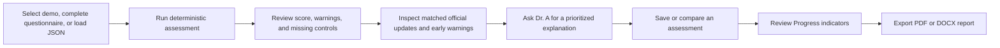
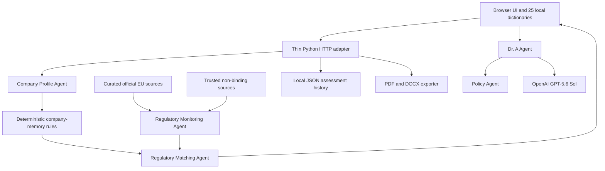

# Dr. G.D.P.R. & AI Act navigator - Design Document

**Project stage:** Working MVP  
**Document purpose:** Technical review of product scope, architecture, implementation choices, and next validation steps

## 1. Executive Summary

Dr. G.D.P.R. & AI Act navigator is a local-first decision-support application for European AI startups and SMEs. It converts a structured company questionnaire into an explainable GDPR and EU AI Act attention profile, identifies missing or unverified controls, ranks relevant regulatory developments, and provides an AI assistant called Dr. A.

The deterministic assessment engine is the source of truth for scores, warnings, and applicability tags. The language model explains the structured result but does not calculate or modify it. This separation makes the MVP auditable and reduces the risk of unsupported legal conclusions.

The application is not a legal-advice service and does not certify compliance. It helps users identify what should be reviewed and prioritized with qualified professionals.

## 2. Problem

European AI startups must monitor overlapping AI Act and GDPR obligations while operating with limited legal, compliance, and engineering resources. Three practical problems follow:

1. General regulatory updates do not explain whether an item matters to a specific company.
2. News, commentary, official guidance, drafts, and binding law are frequently presented without a clear distinction.
3. Small teams often lack an actionable starting point: which systems, data practices, controls, and evidence should be reviewed first.

The resulting information overload can lead either to inaction or to disproportionate compliance work that is not connected to the company's actual risk profile.

## 3. Proposed Solution

The Navigator combines four layers:

- a multilingual company questionnaire;
- deterministic GDPR and AI Act profiling and scoring;
- a personalized official-source and early-warning feed;
- a local AI explanation assistant with policy guardrails.

The output is a company-specific dashboard rather than a generic regulatory news page. Users can inspect why a warning or score was produced, review missing controls, compare saved assessments, export a report, and ask follow-up questions in natural language.

## 4. Target Users

### Primary users

- founders and product leads at European AI startups;
- compliance or privacy owners in SMEs;
- technical leaders preparing an AI governance process;
- teams evaluating whether an AI use case may require specialist review.

### Initial demo scenarios

1. A low-risk SaaS company using AI internally.
2. An HR AI company processing sensitive data and supporting employment decisions.
3. A general-purpose AI model provider.

## 5. Competitive Landscape and Added Value

The project competes indirectly with four solution categories:

| Category | Typical strength | Gap addressed by this MVP |
|---|---|---|
| Enterprise GRC suites | Broad governance workflows | Often too complex or costly for an early-stage startup |
| AI governance platforms | Model inventory and governance | May not combine company profiling with a regulatory early-warning feed |
| Legal advisory services | High-quality professional interpretation | Not continuously available as a lightweight self-service starting point |
| Generic regulatory feeds | Wide information coverage | Updates are not prioritized against a specific company profile |

The Navigator's added value is the combination of explainable company profiling, source-status separation, personalized prioritization, grounded OpenAI explanations, and an accessible startup-oriented interface. It is designed to support triage and preparation, not replace professional advice.

## 6. Core Features

### 6.1 Multilingual company onboarding

- Data-driven questionnaire covering company details, AI use, personal data, transfers, governance, and existing controls.
- Separate local dictionaries for all 25 supported languages.
- JSON import and export for reproducible assessments.
- Three built-in demo profiles.

### 6.2 Explainable deterministic assessment

- Relevance tags for GDPR, AI Act, and candidate high-risk AI use cases.
- Missing or unverified control detection.
- Attention score with traceable contributions.
- Expandable evidence showing which questionnaire answers triggered each result.

### 6.3 Personalized regulatory intelligence

- Curated official EU sources and trusted professional sources.
- Clear separation between official updates and non-binding early warnings.
- Company-specific matching, priority scores, and reasons.
- Manual live refresh with local fallback data.

### 6.4 Dr. A assistant

- OpenAI `gpt-5.6-sol` through the official Chat Completions API.
- Company profile and matched regulatory context supplied with each question.
- Question-specific evidence selection for transfers, DPIA, high-risk classification, warning controls, and ordered priorities.
- Short conversation memory for follow-up questions.
- English and Italian policy handling.
- Blocks explicit regulatory evasion, fraud, prompt injection, and requests for guaranteed legal conclusions.
- Progressive response streaming with cumulative policy, citation, and grounding validation.
- One sanitized model-generated correction attempt when a draft contains an unsupported claim; no canned answer replaces model reasoning.

### 6.5 Assessment history and reporting

- Save, load, compare, and delete local assessment snapshots.
- Personalized AI Act timeline.
- PDF and DOCX report export in the selected dashboard language, using the same 25 local dictionaries as the interface.
- Visual selection feedback for profiles and report formats.

### 6.6 Progress and implementation overview

- A dedicated Progress view derives its indicators from the active deterministic assessment.
- Control coverage shows both the numerical split and the concrete existing and missing controls.
- Warning priorities are visualized as a pie chart with a detailed high, medium, and low legend.
- Upcoming milestones reuse the personalized compliance timeline and linked official-source dates.
- The view does not recalculate risk, infer task completion, or certify legal compliance.
- Contextual Help for this view uses the same 25 local dictionaries as the rest of the interface.

## 7. User Flow

## 8. High-Level Architecture

## 9. Low-Level System Design

### 9.1 Frontend

The frontend uses static HTML, CSS, and JavaScript without a build step.

- `module_company_profile/dashboard/index.html`: application shell and views.
- `assets/js/core.js`: application state, questionnaire rendering, dashboard rendering, and shared UI functions.
- `assets/js/events.js`: user actions and API orchestration.
- `assets/js/i18n/`: translation core and one dictionary per language.
- `assets/css/`: component and responsive styling.

This approach reduces installation complexity and keeps the demo inspectable during a technical review.

### 9.2 Backend API

`dashboard_server.py` uses Python's `ThreadingHTTPServer` and exposes:

| Route | Responsibility |
|---|---|
| `GET /api/health` | Runtime, assistant, and model configuration status |
| `POST /api/evaluate` | Evaluate questionnaire answers |
| `POST /api/demo-profile` | Load and evaluate a built-in scenario |
| `POST /api/refresh-news` | Refresh monitored sources and recalculate matches |
| `POST /api/chat` | Stream a contextual Dr. A response |
| Profile routes | Save, load, compare, list, and delete snapshots |
| `POST /api/export-report` | Generate PDF or DOCX output |

### 9.3 Deterministic assessment

`module_agents/company_profile_agent.py` validates the questionnaire and calls
the deterministic services in `company_memory_agent.py` to produce:

- company, AI-use, privacy, and governance profiles;
- relevance tags;
- existing and missing controls;
- relevance tags, controls, and the assessment trace.

`module_agents/regulatory_matching_agent.py` combines that memory with the
active feed and regulatory-event catalog to produce warnings, the attention
score, timeline, and ranked matches. Every material score contribution is
linked to triggering answers. The model is not involved in this calculation.

### 9.4 Regulatory monitoring

`module_agents/regulatory_monitoring_agent.py` is the runtime boundary for live,
cached, and disclosed demo feed selection. It delegates source collection and
normalization to `module_web_scraping/`. Normalized records are stored under
`storage/web_scraping_outputs/` and consumed through stable data contracts.

Official publications and guidance are displayed separately from non-binding professional commentary. Early-warning items are explicitly labelled as requiring verification against official sources.

### 9.5 Assistant and policy controls

`module_agents/dr_a_agent.py` rebuilds a compact question-specific context from
validated server-side data, selects relevant evidence, and calls an
OpenAI-compatible endpoint. The browser cannot supply trusted scores, warnings,
or citations. The model can be replaced through environment variables without
changing application code.

The separate `policy_agent/` package checks user input and model output.
Ordinary free-form questions are allowed. Explicit fraud, evasion, prompt
injection, and requests for guaranteed legal compliance are blocked. Regulatory
sources are offered only when their support text overlaps the user's topic.
Model output is buffered into readable segments, cumulatively validated, and
streamed only after each segment passes. If a draft fails an objective check,
the model receives sanitized correction categories rather than the rejected
claims, preventing error text from contaminating the retry.

### 9.6 Persistence and exports

Assessment snapshots are stored locally as JSON. The report exporter converts the active structured assessment into PDF or DOCX. No external database or cloud account is required for the MVP.

## 10. Technology Stack

| Layer | Technology |
|---|---|
| Frontend | HTML5, CSS3, vanilla JavaScript |
| Backend | Python standard library HTTP server |
| Deterministic logic | Python rules and structured JSON |
| AI explanation layer | OpenAI with `gpt-5.6-sol` |
| Model interface | OpenAI-compatible chat-completions endpoint |
| Reports | ReportLab and python-docx |
| Persistence | Local JSON files |
| Packaging | Docker Compose and Windows launchers |
| Testing and CI | Python `unittest` and GitHub Actions |

## 11. Key Design Decisions

### Deterministic rules before generative AI

Scores and applicability decisions must be reproducible. The model is therefore restricted to explanation and conversational support.

### Local-first application with an explicit OpenAI runtime

The questionnaire, deterministic assessment, action workspace, reports, and persistence run locally. Dr. A explicitly uses the official OpenAI API with the exact `gpt-5.6-sol` model so the submitted runtime is reproducible and cannot silently switch providers.

### Source-status separation

Official sources and non-binding commentary have different legal weight. The interface keeps them visually and structurally separate.

### Compact context instead of unrestricted retrieval

Dr. A receives the active profile and a limited evidence catalog. This improves relevance, latency, and citation control on a 12 GB VRAM demonstration machine.

### File-based persistence for the MVP

JSON snapshots are transparent, portable, and adequate for a single-machine prototype. A database would add operational complexity before user needs are validated.

## 12. Alternatives Considered

| Alternative | Decision |
|---|---|
| OpenAI GPT-5.6 Sol | Selected for grounded explanations |
| Smaller hosted model | Not selected because response quality is more important than minimum cost for this demo |
| LLM-generated compliance score | Rejected because it is difficult to audit and reproduce |
| React or another frontend framework | Deferred; vanilla JavaScript avoids a build pipeline and is sufficient for the current interface |
| Relational or vector database | Deferred until multi-user scale or document-level retrieval requirements justify it |
| Fully automated web crawling | Limited to curated sources to reduce noise, fragility, and unsupported regulatory claims |
| Blocking every off-topic question | Rejected after testing because it produced unnecessary false positives |

## 13. Reliability, Safety, and Privacy

- The application states that it provides general information, not legal advice.
- The deterministic trace explains why warnings and scores were produced.
- Non-binding sources are labelled and require official verification.
- The Policy Agent blocks explicit unsafe compliance requests in English and Italian.
- Only Dr. A requests send the required grounded context to the official OpenAI API; the deterministic assessment and action workflow do not require a model call.
- Reports and profile history remain on the local machine unless the user moves them.

## 14. Testing Strategy

Current validation includes:

- deterministic Policy Agent tests in English and Italian;
- dashboard feature tests for persistence, comparison, API limits, chat-context minimization, timeline, and reporting behavior;
- localization contract tests for every enabled language;
- Progress-view tests for derived control coverage, warning priorities, and timeline milestones;
- localized PDF and DOCX report tests across the 25-language contract;
- three differentiated company scenarios;
- manual end-to-end checks covering questionnaire and JSON loading, scoring, Progress, contextual Help, snapshot persistence, source refresh, Dr. A grounding, policy blocks, multilingual PDF/DOCX export, and visual selection states;
- CI smoke checks for the monitoring pipeline and Docker configuration.

The current release passes 133 focused automated tests. The complete final
manual and automated evidence is recorded in
`docs/FINAL_VALIDATION_REPORT.md`.

## 15. Current Limitations

- This is a decision-support prototype, not a compliance certification system.
- Regulatory source coverage is curated rather than exhaustive.
- Live page structures may change and require source-adapter maintenance.
- File-based persistence is intended for a local demo, not concurrent production users.
- Model responses can still require human review despite grounding and policy controls.
- The MVP does not replace a formal legal assessment or organization-specific counsel.

## 16. Next Steps

- refine source coverage and evidence validation;
- improve accessibility and usability;
- prepare the final validation report;
- create a five-minute pitch and two-minute Q&A preparation sheet.
