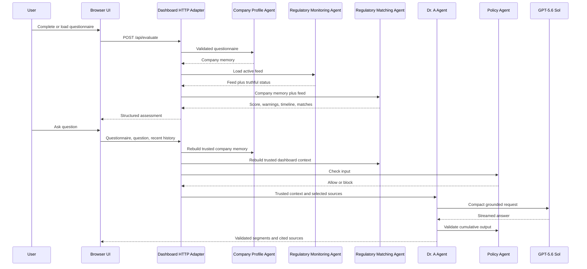

# Runtime Agent Structure

This document describes the implemented agent boundaries. The Navigator uses
four narrow runtime agents plus a separate deterministic Policy Agent. They are
ordinary Python components with explicit inputs and outputs, not an unrestricted
autonomous-agent framework.

## Design rules

- Deterministic assessment remains the source of truth.
- Agent boundaries reflect real runtime responsibilities.
- The model explains structured results; it does not calculate scores.
- Official sources and non-binding early warnings remain distinct.
- No hardcoded answer impersonates model reasoning.
- The browser cannot provide trusted derived compliance data.

## Implemented agents

| Agent | Implementation | Responsibility |
|---|---|---|
| Company Profile Agent | `module_agents/company_profile_agent.py` | Validate questionnaire data and create deterministic company memory |
| Regulatory Monitoring Agent | `module_agents/regulatory_monitoring_agent.py` | Refresh sources and select live, cached, or disclosed demo feed data |
| Regulatory Matching Agent | `module_agents/regulatory_matching_agent.py` | Match company memory to warnings, scores, controls, timeline, events, and news |
| Dr. A Agent | `module_agents/dr_a_agent.py` | Build grounded question context, call GPT-5.6 Sol, validate, stream, and expose citations |
| Policy Agent | `policy_agent/` | Apply deterministic input and output safety boundaries |

## 1. Company Profile Agent

Input:

- completed questionnaire JSON.

Delegated deterministic service:

- `build_company_memory()` in
  `module_company_profile/memory_agent/company_memory_agent.py`.

Output:

- normalized company profile;
- AI-use and privacy profiles;
- governance controls;
- relevance tags;
- missing or unverified controls;
- assessment trace linked to triggering answers.

The agent rejects incomplete public questionnaires before downstream analysis.

## 2. Regulatory Monitoring Agent

Input:

- curated source registry;
- normalized live-feed file;
- feed freshness threshold.

Delegated collection service:

- `module_web_scraping/live_feed.py` and related source adapters.

Output:

- active feed records;
- explicit feed mode: `live`, `cached`, or `demo`;
- update timestamp, source status, and collection errors.

The agent never silently labels cached or bundled data as live.

## 3. Regulatory Matching Agent

Input:

- company memory from the Company Profile Agent;
- current monitored feed;
- curated regulatory-event catalog.

Delegated deterministic services:

- scoring, warnings, timeline, grouping, and matching functions in
  `company_memory_agent.py`.

Output:

- attention score and level;
- warnings and recommended review actions;
- missing controls linked to each warning;
- personalized AI Act timeline;
- ranked official events, updates, and early-warning items;
- evidence explaining which answers triggered each result.

## 4. Dr. A Agent

Input:

- server-rebuilt company memory and dashboard context;
- current user question;
- recent conversation history;
- source catalog selected for the question.

Process:

1. The Policy Agent checks the user request.
2. Dr. A selects the smallest useful evidence scope for the question.
3. OpenAI GPT-5.6 Sol generates the answer.
4. Text is buffered into readable segments.
5. Cumulative policy and grounding checks run before each segment is displayed.
6. If a draft fails, one retry receives sanitized error categories without the
   rejected claims or internal prompt labels.
7. Only citations actually used in the answer are returned to the browser.

Grounding checks cover:

- unsupported legal articles;
- controls not linked to the requested warning;
- unsupported named international-transfer mechanisms;
- confirmed versus unresolved transfer facts;
- DPIA screening versus completed-DPIA residual risk;
- internal prompt terminology;
- corrupted text or unintended language switching.

Dr. A does not contain prewritten compliance answers. Deterministic logic is
used only for evidence selection, validation, policy enforcement, and format
control.

## 5. Policy Agent

Input checks cover:

- regulatory evasion and compliance washing;
- fraud or fabricated evidence;
- prompt injection;
- demands for definitive legal certification.

Output checks prevent unsafe model claims from being displayed. The Policy
Agent is separate from the OpenAI GPT-5.6 Sol explanation layer, so model output
cannot remove the application boundary.

## Runtime sequence

## HTTP orchestration boundary

`module_company_profile/dashboard/dashboard_server.py` is a thin adapter. It
validates HTTP data, invokes agents, streams events, and serializes files. It
does not calculate the assessment or provide canned chat responses.

## Future extensions

Additional tools or orchestration can be added later, but they should preserve
the same explicit boundaries and auditable handoffs. A future vector store,
database, or scheduled monitor is not represented as already implemented.
