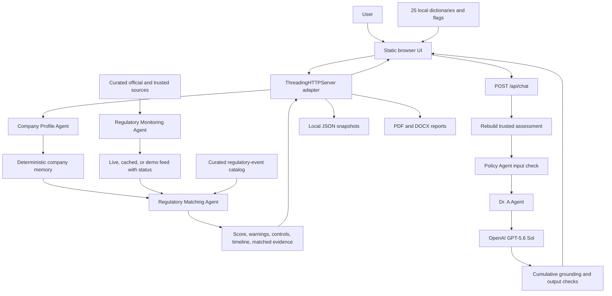

# Current System Architecture

## Scope

Dr. G.D.P.R. & AI Act navigator is a local, single-user decision-support MVP.
It combines deterministic company assessment, curated regulatory monitoring,
company-specific matching, multilingual presentation, and an assistant powered
by OpenAI GPT-5.6 Sol. It does not provide legal certification.

## Architecture principles

- Scores, tags, warnings, and timelines are deterministic and reproducible.
- Runtime agents have narrow responsibilities and explicit handoffs.
- Official sources and non-binding early warnings have different status.
- The server rebuilds trusted context from questionnaire answers.
- The OpenAI model cannot override deterministic assessment results.
- Policy and grounding validation are independent of model intelligence.
- All browser dictionaries and flags are served locally.

## Implemented architecture

## Frontend

The frontend uses HTML, CSS, and vanilla JavaScript with no build step:

- `module_company_profile/dashboard/index.html` loads the application;
- `assets/js/core.js` owns schema, state, rendering, and translation lookup;
- `assets/js/events.js` owns user events and API calls;
- `assets/js/i18n/locales/` contains one complete file per supported language;
- `assets/css/` separates base, component, layout, and responsive styling;
- `assets/flags/` and `assets/fonts/` keep visual assets local.

The UI provides complete local dictionaries for all 25 supported languages.

## HTTP adapter

The backend uses Python's `ThreadingHTTPServer` rather than a web framework. The
adapter validates request size and shape, invokes the runtime agents, serves
static files, streams NDJSON chat events, and handles exports.

The browser may submit questionnaire answers and conversation history, but
derived scores, warnings, controls, company metadata, and citations are rebuilt
server-side before sensitive operations.

## Deterministic assessment layer

`company_memory_agent.py` contains the auditable domain rules:

- questionnaire contract validation;
- answer normalization;
- tag and missing-control derivation;
- assessment traces;
- score contributions;
- warning generation;
- regulatory matching and grouping;
- timeline construction.

The Company Profile Agent and Regulatory Matching Agent expose these services
as separate runtime responsibilities.

## Monitoring layer

`module_web_scraping/` contains source ingestion, normalization, grouping,
validation, scoring, and live-feed persistence. The Regulatory Monitoring Agent
exposes an active feed while disclosing whether it is live, cached, or bundled
demo data.

## Conversational layer

Dr. A receives compact, question-specific assessment information. Dedicated
evidence scopes exist for:

- ordered priorities;
- possible high-risk classification;
- DPIA and prior consultation;
- international transfers;
- warning-to-control relationships;
- general assessment explanations.

The model produces the natural-language answer. Deterministic validators check
objective boundaries without replacing the answer with canned text. Responses
stream in readable segments after cumulative validation.

## Policy layer

The separate Policy Agent provides English and Italian deterministic guards for
regulatory evasion, fraud, prompt injection, and definitive legal guarantees.
It checks both input and output and remains active regardless of which local
model is configured.

## Persistence and reports

- Assessment snapshots: local JSON under `storage/company_profile/history/`.
- Active monitored data: JSON under `storage/web_scraping_outputs/`.
- Reports: PDF and DOCX generated from server-rebuilt assessment data.
- Model access: official OpenAI Chat Completions API with a process-scoped key.

## Derived Progress view

The Progress page is a presentation-only projection of the active assessment.
It reads the existing score, control lists, warning levels, and personalized
timeline already returned by the deterministic pipeline. It does not persist a
second state, recalculate legal risk, or use the language model. Its pie and
coverage charts are rendered locally with CSP-compatible SVG, and their detailed
legends remain readable without relying on color alone.

No production database, cloud account, or external translation API is required.

## Deployment

The project supports:

- native Windows start through `Start dashboard.bat`;
- native macOS/Linux start through `Start-Dashboard.sh`;
- reproducible OpenAI-enabled dashboard startup through Docker Compose;
- process-scoped authentication through `OPENAI_API_KEY`.

The runtime model is fixed to `gpt-5.6-sol` at the official OpenAI endpoint
without changing the deterministic assessment logic.

## Current boundaries

- curated rather than exhaustive regulatory-source coverage;
- local single-user storage;
- no complete article-level legal retrieval system;
- no claim of legal advice or compliance certification;
- model output still requires professional review for legal decisions;
- national implementation law coverage is outside the current MVP.
