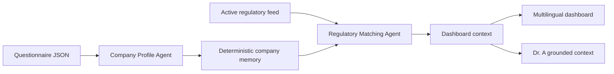

# Company Profile Module

This module contains the implemented questionnaire, deterministic assessment
services, dashboard, local persistence, report export, and Docker configuration.

## Runtime flow

## Folder structure

- `dashboard/`: HTTP adapter, frontend, derived Progress view, contextual Help, snapshots, and report exporter.
- `memory_agent/`: deterministic questionnaire validation, profile derivation,
  scoring, warnings, matching, and timeline services.
- `memory/`: company-memory data contract.
- `questionnaire/`: questionnaire design and mapping notes.
- `Dockerfile`: shared Python image for dashboard and CLI memory generation.
- `docker-compose.yml`: local dashboard configured for the OpenAI API.

Runtime agent boundaries live in `../module_agents/`; policy checks live in
`../policy_agent/`.

## Implemented capabilities

- complete questionnaire validation;
- three differentiated demo profiles;
- deterministic GDPR and AI Act relevance tags;
- linked missing controls and explainable score contributions;
- personalized warnings, timeline, events, updates, and early warnings;
- local assessment snapshots and comparisons;
- PDF and DOCX report export localized from the selected dashboard language;
- deterministic Progress visualization for controls, warning priorities, and deadlines;
- all 25 supported languages;
- grounded OpenAI explanations through Dr. A.

## Boundary

The module supports compliance triage and prioritization. It does not provide
legal advice or certify that an organization is compliant.
